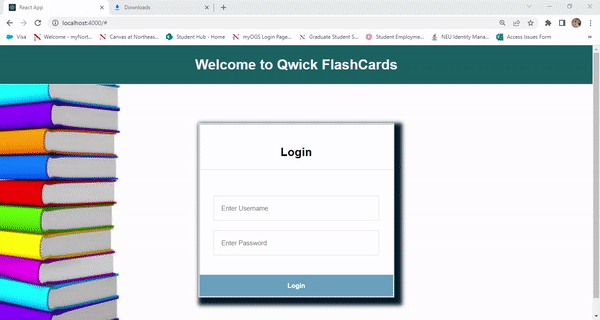
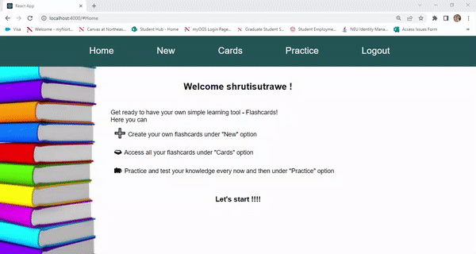
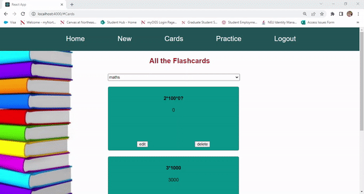
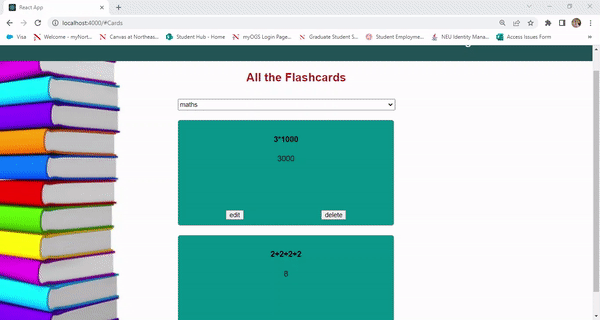

# React Flash Cards

An interactive React application to let users login, create, edit, delete, and view flashcards on various subjects.  Users can use the "Practice" feature to quiz themselves to get ready for their next big exam!

## Technologies Used
- React, Node, Express, CSS
- Data persist in memory.

## Key Features

### Users can Login into flashcards



### Users can create flashcards under "New" Option


### Users can view saved flashcards under "Cards" Option



### Users can edit flashcards 



### Users can delete flashcards


### Users can practice their flashcards under "Practice" Option



### Getting Started

```

Install dependencies.
```
- cd flashcards/
- npm install
```

### Run build
```
- npm run build
- npm start
```
